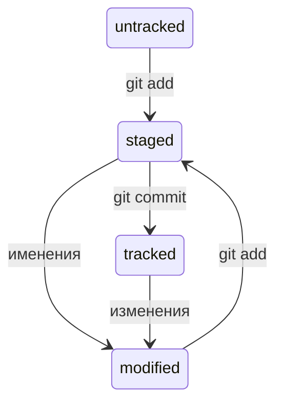

# Шпаргалка по Git

## Установка

### Для Windows

1. Перейти на [официальный сайт Git](https://git-scm.com/download/win) и скачать Standalone installer для своей версии Windows
2. Запустить установщик и следовать инструкциям
3. Проверить, стоит ли галочка напротив Git Bash here - это позволит открывать консоль с Git в любой папке

### Для Linux

1. На [официальном сайте Git](https://git-scm.com/download/linux) найти команду для своей версии Linux
2. Скопировать команду в Terminal и выполнить ее

### Для MacOS

#### 1 способ

В консоли выполнить команду `/usr/bin/git`, далее следовать инструкциям установщика

#### 2 способ

1. Установить Homebrew
2. В консоли выполнить команду `brew install git`

## GitHub

### Регистрация

1. Перейти на [главную страницу GitHub](https://github.com/)
2. Нажать кнопку Sign up и следовать инструкциям
3. Нажать Create account
4. Ввести код, который придет на указанную почту

### Создание удаленного репозитория

1. Зайти в свой профиль
2. Перейти во вкладку репозитории
3. Нажать на кнопку New
4. Назвать репозиторий и выставить другие настройки при необходимости

## SSH-ключи

Для того, чтобы обезопасить обмен данными в сети использются SSH-ключи (**S**ecure **Sh**ell Protocol).  
SSH использует пару ключей:
- **приватный**
  - используется для расшифровки данных
  - хранится на компьютере пользователя
  - **НЕ ДОЛЖЕН** передаваться кому-либо еще
- **публичный**
  - используется для шифрования данных
  - доступен всем
  - данные зашифрованные этим ключом могут быть расшифрованы парным *приватным* ключом

### Проверка наличи SSH-ключей

1. Перейти в домашнюю директорию `cd ~`
2. Выполнить команду `ls -la .ssh/`, которая проверит наличие директории .ssh/ и файлов в ней
3.  
   - Если папка пустая или ее нет, то можно генерировать новый ключ
   - Если есть ключи, но вы их не создавали то нужно их удалить (примеры ключей: id_dsa.pub, id_ecdsa.pub, id_ed25519.pub, id_rsa.pub)

### Генерация ключей

1. Выполнить команду в консоли `ssh-keygen -t ed25519 -C "электронная почта, к которой привязан ваш аккаунт на GitHub"`
   - Если появлятся сообщение об ошибке, занчит скорее всего система не поддерживает этот алгоритм шифрования
   - Тогда можно воспользоваться другим алгоритмом, например: `ssh-keygen -t rsa -b 4096 -C "электронная почта, к которой привязан ваш аккаунт на GitHub"`
2. Указать место хранения ключей (оставить пустым, чтобы использовать домашнюю директорию)
3. Программа запросит создать кодовую фразу (пароль от ключа). Можно оставить пустым

### Привязывание SSH-ключа к GitHub

1. Скопировать содержимое пубичного ключа в буфер обмена
   - macOS: `pbcopy < ~/.ssh/id_ed25519.pub`
   - Windows: `clip < ~/.ssh/id_ed25519.pub`
   - Если это не срботает, то можно вывести содержимое на экран и скопировать вручную: `cat ~/.ssh/id_ed25519.pub`
2. Перейти на GitHub, выбрать пункт Settings в меню аккаунта
3. В меню слева выбрать **SSH and GPG keys**
4. В открывшейся вкладке нажать **New SSH key**
5. В поле **Title** - название ключа
6. В поле **Key type** выбрать **Authentication Key**
7. В поле **Key** вставить ключ из буфера обмена
8. Нажать кнопку **Add SSH key**
9. Проверить правильность ключа с поиощью команды `ssh -T git@github.com`
10. В предупреждении проверить ключ на сходство с [этими](https://docs.github.com/en/authentication/keeping-your-account-and-data-secure/githubs-ssh-key-fingerprints)
11. Ввести yes, если ключ совпадает, no, если не совпадает

## Хеш

**Хеширование** - способ преобразовать набор данных и получить их "отпечаток" (уникальный идентификатор).

Git хеширует информацию о коммите с помощью **алгоритма SHA-1**(Secure Hash Algorithm) и получает для каждого коммита уникальный хеш.

**Хеш** - короткая (40 символов в случае SHA-1) строка, состоящая из цифр 0-9 и латинских букв A-F.

### Свойства хеша

- Если хеш получить дважды для одного и того же набора входных данных, то результат будет гарантированно одинаковый
- Если хоть что-то в исходных данных поменяется (хотя бы один символ), то хеш тоже изменится (причём сильно)

### Хеш - основной идентификатор коммита

Git хранит таблицу соответствий `хеш -> информация о коммите` в скрытой папке `.git` в репозитории проекта.

Если известен хеш, то можно получить всю остальную информацию о коммите (автора, дату, содержимое).

Хеш можно указывать в качестве парамтера для различных Git-команд, чтобы указать, с каким коммитом нужно работать.

## Лог

**Лог** - список коммитов с описанием каждого из них.

Вывести лог можно с помощью команды `git log`

Описание коммита состоит из:
- **хеш коммита** - строка из цифр и латинских букв после слова commit
- **Author** - имя и электронная почта автора
- **Date** - дата и время коммита
- **сообщение коммита**

### Сокращенный лог

Получить сокращенный лог можно при помощи команды `git log --oneline`

В **сокращенном логе** выводятся только сообщение коммита и **сокращенный хеш** (первые несколько символов хеша).

**Сокращенный хеш** можно использовать также как и полный. Для этого команда `git log --oneline` автоматически подбирает такую длину сокращенных хешей, чтобы они были уникальными в пределах репозитория и Git всегда мог понять о каком коммита идет речь.

## HEAD

Файл `HEAD` - один из служебных файлов папки `.git`. Он указывает на последний коммит (на самый новый).

Внутри `HEAD` — ссылка на служебный файл: `refs/heads/master` (или `refs/heads/main`). В этом файле записан хеш последнего коммита.

Когда делается новый коммит, Git обновляет `refs/heads/master` - записывает в него хеш последнего коммита. При этом `HEAD` тоже обновляется, так как ссылается на `refs/heads/master`. 

`HEAD` можно передавать в Git-команды, которые принимают хеш, чтобы указать, что работать нужно с последним коммитом.

## Статусы файлов в Git

- **untracked** (неотслеживаемый)
  - этот статус имеют все новые файлы (Git видит файл, но не следит за его изменениями)
  - у untracked файлов нет предыдущих версий, зафиксированных в коммитах или через `git add`
- **staged** (подготовленный), альтернативные названия: **indexed**, **cached**
  - после выполнения комады `git add` файл попадает в *staging area*, т.е. в список файлов, которые войдут в коммит. В этот момент файл находится в состоянии *staged*.
- **tracked** (отслеживаемый)
  - это состояние противоположность **untracked**
  - в него попадают файлы, которые уже были зафиксированы с помощью `git commit`, а также файлы добавленные в *staging area* командой `git add`. Т.е. все файлы, в которых Git так или иначе отслеживает изменения.
- **modified** (измененный)
  - сюда попадают все файлы, в которых Git нашел отличия от последней сохраненной версии

Для файлов в состояниях **staged** и **modified** обычно не указывают, что они также **tracked**, потому что это состояние подразумевается.

### staged и modified

Команда `git add` добавляет в *staging area* только текущее содержимое файла. Если изменить файл, когда он уже в *staging area*, но еще не закоммичен, то новая версия файла будет иметь статус **modified**. Чтобы добавить последнюю версию в *staging area* нужно еще раз выполнить команду `git add`.

### Типичный жизненный цикл файла в Git

1. Файл только что создали. Git ещё не отслеживает содержимое этого файла. Состояние: **untracked**.
2. Файл добавили в *staging area* с помощью `git add`. Состояние: **staged** (+ **tracked**).
   - Возможно, изменили файл ещё раз. Состояния: **staged**, **modified** (+ **tracked**).
   - Обратите внимание: **staged** и **modified** у одного файла, но у разных его версий.
   - Ещё раз выполнили `git add`. Состояние: **staged** (+ **tracked**).
3. Сделали коммит с помощью `git commit`. Состояние: **tracked**.
4. Изменили файл. Состояние: **modified** (+ **tracked**).
5. Снова добавили в *staging area* с помощью `git add`. Состояния: **staged** (+ **tracked**).
6. Сделали коммит. Состояния: **tracked**.
7. Повторили пункты 4-7 много-много раз.

### `git status`

Чтобы узнать текущее состояние репозитория можно использовать команду `git status`.

`git status` подсказывает, какие команды можно выполнить, чтобы поменять состояние файла.

#### Какие состояния показывает `git status`

- **staged** (Changes to be committed в выводе `git status`);
- **modified** (Changes not staged for commit);
- **untracked** (Untracked files).

#### Варианты вывода `git status`

1. Нет ни **staged**-, ни **modified**-, ни **untracked**-файлов
   - nothing to commit, working tree clean
2. Найдены неотслеживаемые файлы
   - Untracked files: # найдены неотслеживаемые файлы 
  (use "git add <file>..." to include in what will be committed)
   - После `git add`: Changes to be committed: # новая секция 
  (use "git restore --staged <file>..." to unstage)
3. Найдены изменения, которые не войдут в коммит
   - Changes not staged for commit: # ещё одна секция 
  (use "git add <file>..." to update what will be committed) 
  (use "git restore <file>..." to discard changes in working directory)
4. Файл добавлен в staging area, но после этого изменён
   - Changes to be committed: 
  (use "git restore --staged <file>..." to unstage) 
          modified:   fileA.txt  
     Changes not staged for commit: 
  (use "git add <file>..." to update what will be committed) 
  (use "git restore <file>..." to discard changes in working directory) 
          modified:   fileA.txt 

## Основные команды

`git init` - **инициализировать** репозиторий в текущей папке  
`git version` - **узнать** текущую установленную версию git (можно использовать для проверки установки git)
`rm -rf .git` - **удалить** репозиторий (нужно удалить `.git`)  
`git status` - проверить **текущий статус** репозитория  
`git add <имя файла>` - указать какие файлы нужно **отслеживать** (для добавления всех файлов можно использовать флаг --all или . (текущая директория))  
`git commit -m '<сообщение коммита>'` - **сохранить** текущие версии добавленных (при помощи `git add`) файлов  
`git remote add <имя удаленного репозитория (обычно `origin`)> <URL удаленного репозитория>` - **связать** локальный и удаленный репозиторий  
`git remote -v` - **убедиться**, связаны ли репозитории  
`git remote rm origin` - **отвязать** локальный репозиторий от удаленного  
`git push -u origin master` - **отправить изменения** на удаленный репозиторий (первый раз)
- флаг `-u` связывает локальную ветку master с одноименной удаленной
- origin - имя удаленного репозитория
- master - название ветки  

`git push` - **отправить изменения** на удаленный репозиторий  
`git log` - **вывести полный лог** (список коммитов)  
Выводит:
- **хеш коммита** - строка из цифр и латинских букв после слова commit
- **Author** - имя и электронная почта автора
- **Date** - дата и время коммита
- **сообщение коммита**

`git log --oneline` - **вывести сокращенный лог**  
Выводит:
- **сокращенный хеш**
- **сообщение коммита**
